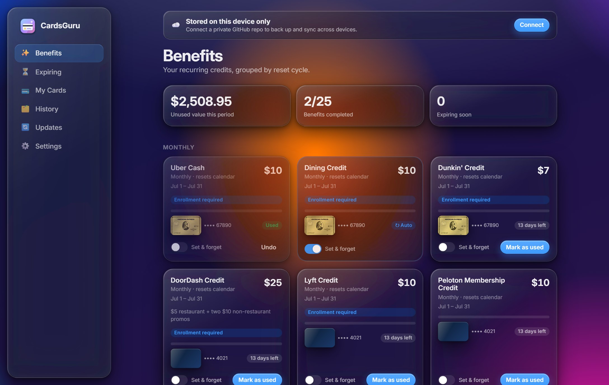
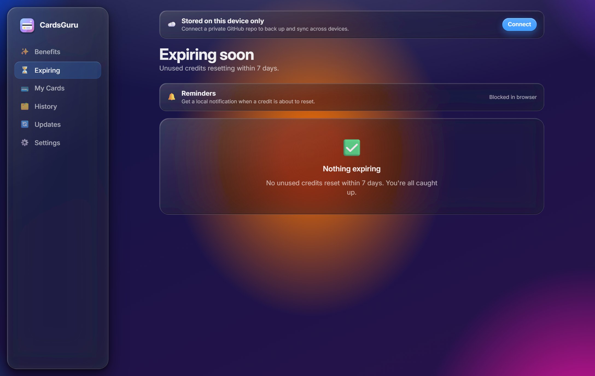
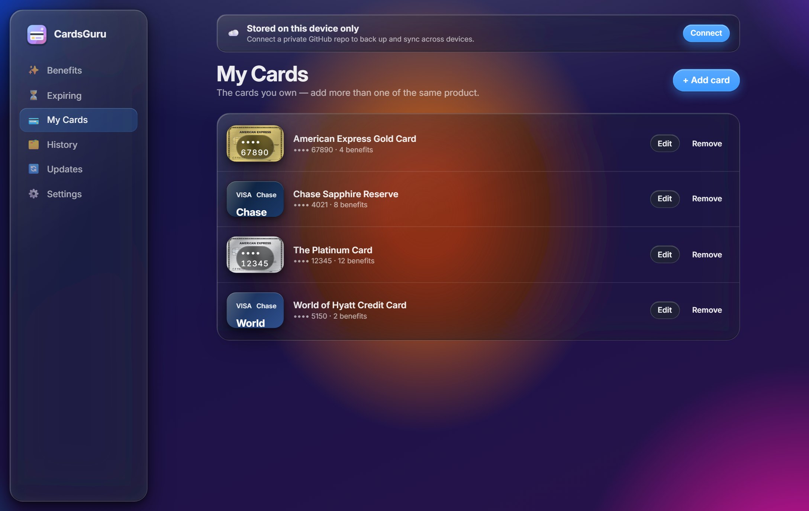
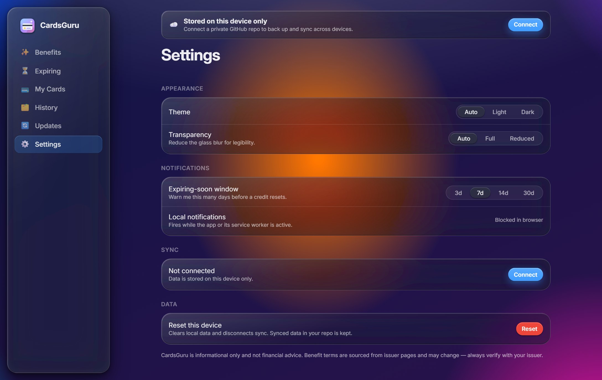
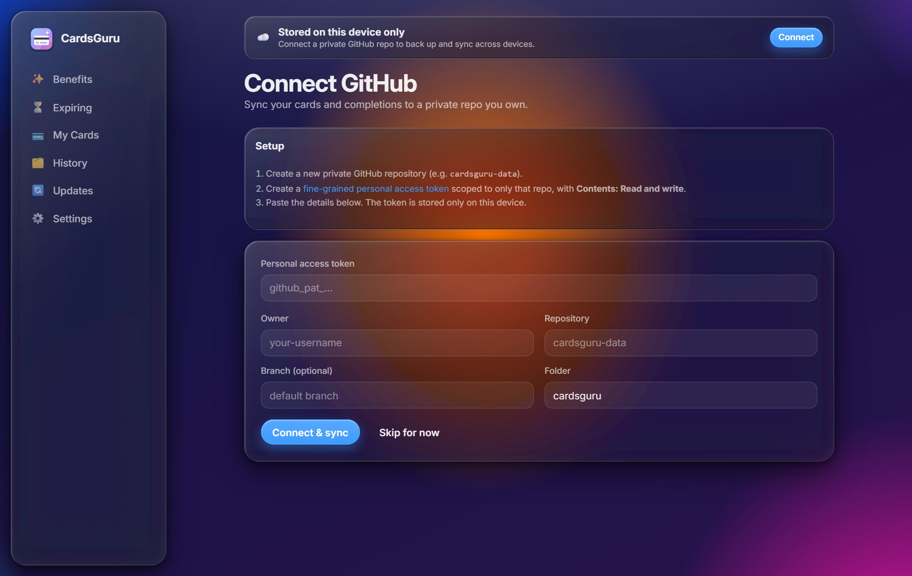
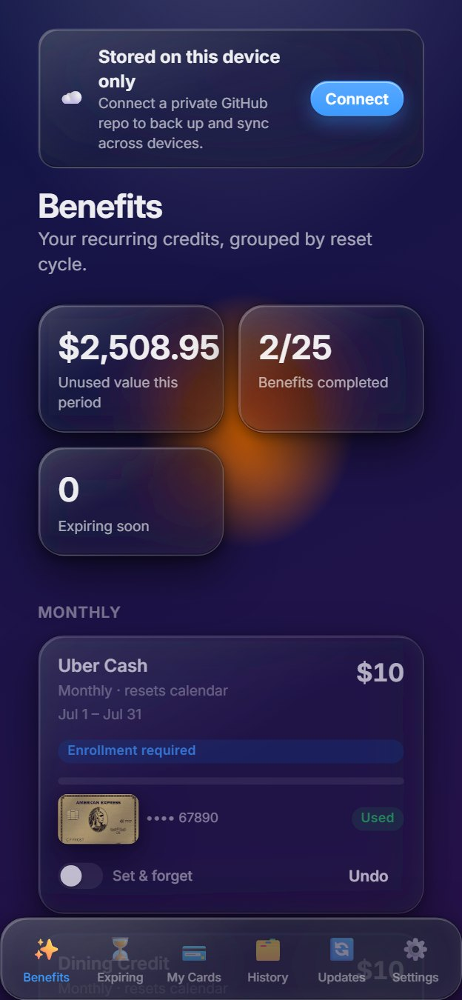

# CardsGuru

Track the **recurring benefits** of your credit cards — monthly, quarterly, semi-annual, annual,
and membership-year credits — mark them used each period, and get warned before unused credits
expire.

CardsGuru is a **local-first Progressive Web App**. It runs entirely in your browser (no backend),
and your data syncs across devices through **a private GitHub repository that you own**.

## Highlights

- **Your data, your repo.** Cards and completion history are stored as JSON in a private GitHub
  repo you provide, using a fine-grained Personal Access Token that never leaves your device.
- **Multiple cards supported.** Hold two of the same product? Each card is tracked separately,
  keyed by its last-4 digits.
- **Period-aware.** A tested period engine understands calendar and card-anniversary reset cycles.
- **Liquid Glass UI.** A native macOS-style translucent interface, with light/dark and reduced
  transparency/motion fallbacks. Installable and mobile-friendly.
- **Stays current.** A catalog update module checks for benefit changes and newly released cards.

> CardsGuru is informational only and is **not financial advice**. Benefit terms change; always
> confirm details with your card issuer.

## Screenshots

The **Benefits** dashboard — every recurring credit your cards offer, grouped by reset cycle, with
one-tap "mark used", **Set & forget** automation for standing subscriptions, and expiry warnings:

<p align="center">
  
</p>

| Expiring soon | My cards |
| :---: | :---: |
|  |  |
| **Settings** | **Connect &amp; sync** |
|  |  |

<p align="center">
  
  <br /><em>Installable PWA — the desktop sidebar collapses to a mobile tab bar.</em>
</p>

<sub>Screenshots are generated from the running app by <code>scripts/screenshots.mjs</code> (Playwright).</sub>

## Tech stack

React 18 · TypeScript · Vite · Zustand · IndexedDB (`idb`) · date-fns · Zod · framer-motion ·
vite-plugin-pwa · Vitest.

## Getting started

```bash
npm install
npm run dev
```

Other scripts:

```bash
npm run build      # type-check + production build
npm run preview    # preview the production build
npm run test       # run unit tests
npm run lint       # lint
npm run format     # prettier
```

## Syncing with GitHub

Sync is optional — CardsGuru works fully offline on a single device. To sync across devices:

1. Create a **private** repository (e.g. `cardsguru-data`). It can be empty.
2. Create a **fine-grained Personal Access Token**
   (GitHub → Settings → Developer settings → Fine-grained tokens):
   - **Repository access:** only the repo you just created.
   - **Permissions:** *Contents* → **Read and write**.
3. In CardsGuru, open **Connect**, paste the token, and choose the `owner/repo` (and optional
   subfolder, default `cardsguru/`). The app initializes the JSON files and syncs from then on.

Your token is stored **only in this browser's IndexedDB** and is sent solely to `api.github.com`.
It is never committed to your repo or shared with any third party. Data is merged last-write-wins
per record using each record's `updatedAt`, so edits from multiple devices converge.

## Project structure

```
src/
  components/   Reusable UI (incl. the Liquid Glass primitives)
  features/     Screens: onboarding, cards, dashboard, expiring, updates, settings, history
  lib/          Domain logic: period engine, catalog, sync/data-access, storage, notifications
  store/        App state (Zustand)
  data/         Bundled catalog snapshot + types
  routes/       Router configuration
public/
  catalog/      Canonical catalog JSON served/updated at runtime
```

## Deploying

A GitHub Actions workflow (`.github/workflows/deploy.yml`) type-checks, lints, tests, builds, and
publishes to **GitHub Pages** on every push to `main`.

- In the repo settings, set **Pages → Build and deployment → Source** to **GitHub Actions**.
- For a project page at `https://<user>.github.io/<repo>/`, the workflow sets `CARDSGURU_BASE` to
  `/<repo>/` automatically so assets resolve. Routing uses `HashRouter`, so deep links and refreshes
  work without extra server config.

To build for a custom base locally:

```bash
CARDSGURU_BASE=/my-base/ npm run build
```

